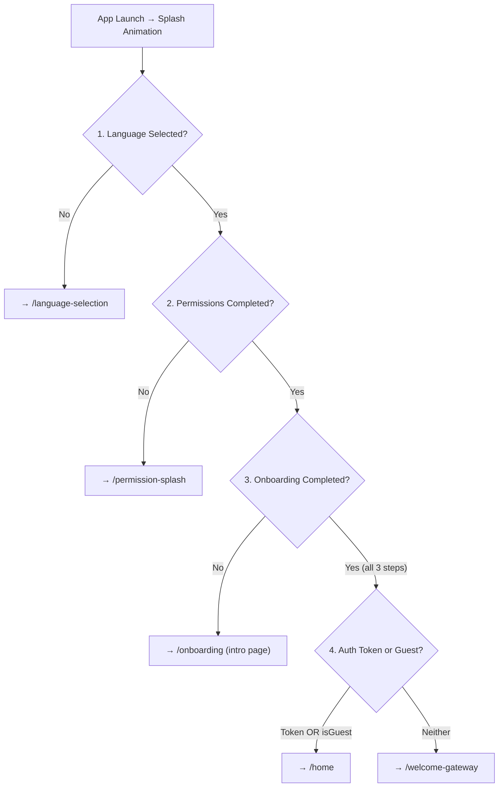
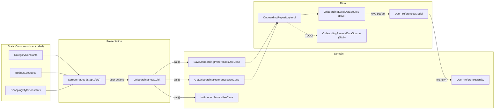

# 🗺️ The Onboarding Map — Deep Technical Analysis

## 1. Architecture & Structure Audit

### Directory Structure

```
lib/features/onboarding/
├── data/
│   ├── data_sources/
│   │   ├── onboarding_local_data_source.dart    ← Hive via LocalCacheService
│   │   └── onboarding_remote_data_source.dart   ← Stub (TODO: API not ready)
│   ├── models/
│   │   ├── user_preferences_model.dart          ← Hive DTO (@HiveType)
│   │   └── user_preferences_model.g.dart        ← Generated adapter
│   └── repositories/
│       └── onboarding_repository_impl.dart      ← Implements OnboardingRepository
├── domain/
│   ├── entities/
│   │   └── user_preferences_entity.dart         ← Pure domain entity (Equatable)
│   ├── repositories/
│   │   └── onboarding_repository.dart           ← Abstract contract
│   └── use_cases/
│       ├── get_onboarding_preferences_use_case.dart
│       ├── save_onboarding_preferences_use_case.dart
│       └── init_interest_scores_use_case.dart
└── presentation/
    ├── cubit/
    │   ├── onboarding_flow_cubit.dart           ← 659 lines, unified controller
    │   └── onboarding_flow_state.dart           ← Custom state (not BaseState)
    ├── pages/
    │   ├── language_selection_page.dart
    │   ├── onboarding_preferences_screen.dart   ← Step 1: Categories
    │   ├── onboarding_budget_screen.dart         ← Step 2: Budget
    │   ├── onboarding_shopping_style_screen.dart ← Step 3: Shopping Styles
    │   └── onboarding_completion_loading_page.dart ← Animated transition → Home
    └── widgets/
        ├── category_card.dart
        ├── onboarding_action_buttons.dart
        └── onboarding_submit_button.dart
```

> [!IMPORTANT]
> There is also a **separate** [onboarding_screen.dart](file:///d:/Courses/AMITFlutter/coupon/lib/features/auth/presentation/pages/onboarding_screen.dart) living under `features/auth/presentation/pages/`. This is the **intro/landing page** (hero image + "Continue" button) that precedes the 3-step preferences flow. It is _not_ inside the `onboarding` feature folder — a misplacement worth noting.

### Onboarding Data Source

| Aspect | Status |
|---|---|
| Slide titles/descriptions | **Not applicable** — this is not a traditional "swipe slides" onboarding. It's a 3-step preference wizard. |
| Category names & icons | Driven from `CategoryConstants` (hardcoded constants file), **not** from a model or API. |
| Budget options | Driven from `BudgetConstants` — hardcoded. |
| Shopping style options | Driven from `ShoppingStyleConstants` — hardcoded. |
| Intro page content | Hardcoded in [OnboardingScreen](file:///d:/Courses/AMITFlutter/coupon/lib/features/auth/presentation/pages/onboarding_screen.dart#10-80) via localization keys (`l10n.onboarding_intro_title`, etc.) and a static asset ([assets/images/onboarding_hero.png](file:///d:/Courses/AMITFlutter/coupon/assets/images/onboarding_hero.png)). |

### Cubit & States

The [OnboardingFlowCubit](file:///d:/Courses/AMITFlutter/coupon/lib/features/onboarding/presentation/cubit/onboarding_flow_cubit.dart) is a **unified, 659-line Cubit** managing all 3 steps + interest tracking.

**State fields** ([OnboardingFlowState](file:///d:/Courses/AMITFlutter/coupon/lib/features/onboarding/presentation/cubit/onboarding_flow_state.dart#15-179)):

| Field | Type | Purpose |
|---|---|---|
| `currentStep` | `int` (1–3) | Active step number |
| `navigationSignal` | `OnboardingNavigation` enum | UI navigation trigger |
| `selectedCategories` | `List<String>` | Step 1 selections |
| `isStep1Valid` | `bool` | Step 1 validation |
| `budgetPreference` | `String?` | Step 2 selection |
| `budgetSliderValue` | `double` | Step 2 slider |
| `isStep2Valid` | `bool` | Step 2 validation |
| `shoppingStyles` | `List<String>` | Step 3 selections |
| `isStep3Valid` | `bool` | Step 3 validation |
| `isSaving` / `isCompleted` / `isSkipped` | `bool` | Flow control |
| `hasChanges` | `bool` | Change detection (for re-visit) |
| `errorMessageKey` / `successMessageKey` | `String?` | Localized feedback keys |

**Navigation signals** (`OnboardingNavigation` enum):
`none` → `toBudget` → `toShoppingStyle` → `toLoading` → `toPermissions` → `toLogin`

---

## 2. Persistence & Navigation Logic (The Guard Logic)

### Where is "Onboarding Seen" Stored?

There is **no simple boolean flag** like `onboarding_seen`. Instead, the app checks **whether the full [UserPreferencesModel](file:///d:/Courses/AMITFlutter/coupon/lib/features/onboarding/data/models/user_preferences_model.dart#8-131) exists in Hive and whether all 3 steps are completed**.

| Technology | Key | Box |
|---|---|---|
| **Hive** (via `LocalCacheService`) | `user_onboarding_preferences` | `onboarding_preferences_box` |

The entity's computed property `isOnboardingCompleted` acts as the "seen" flag:

```dart
// user_preferences_entity.dart
bool get isOnboardingCompleted =>
    isStep1Completed && isStep2Completed && isStep3Completed;
```

### Startup Chain (The 4-Step Guard)

The guard lives in [splash_screen.dart](file:///d:/Courses/AMITFlutter/coupon/lib/features/auth/presentation/pages/splash_screen.dart), executed sequentially after the splash animation:



**Step 3 logic in code** ([_checkOnboardingStatus](file:///d:/Courses/AMITFlutter/coupon/lib/features/auth/presentation/pages/splash_screen.dart#99-123) in splash):
```dart
final onboardingRepository = dl.sl<OnboardingRepository>();
final onboardingResult = await onboardingRepository.getLocalPreferences();

onboardingResult.fold(
  (failure) => context.go(AppRouter.onboarding),  // No data → show onboarding
  (preferences) {
    if (preferences != null && preferences.isOnboardingCompleted) {
      _checkAuthToken();  // All 3 steps done → next gate
    } else {
      context.go(AppRouter.onboarding);  // Incomplete → show onboarding
    }
  },
);
```

### "Get Started" / "Skip" Button Logic

| Button | Where | What Happens |
|---|---|---|
| **Continue** (intro page) | [OnboardingScreen](file:///d:/Courses/AMITFlutter/coupon/lib/features/auth/presentation/pages/onboarding_screen.dart#10-80) (under `auth/`) | `context.go(AppRouter.onboardingPreferences)` — hard navigation to Step 1 |
| **Next** (Step 1) | [onboarding_preferences_screen.dart](file:///d:/Courses/AMITFlutter/coupon/lib/features/onboarding/presentation/pages/onboarding_preferences_screen.dart) | Calls `cubit.completeCategorySelection()` → saves progress → emits `OnboardingNavigation.toBudget` → listener does `context.push(AppRouter.onboardingBudget)` |
| **Next** (Step 2) | [onboarding_budget_screen.dart](file:///d:/Courses/AMITFlutter/coupon/lib/features/onboarding/presentation/pages/onboarding_budget_screen.dart) | Calls `cubit.completeBudgetSelection()` → saves → emits `OnboardingNavigation.toShoppingStyle` |
| **Submit** (Step 3) | [onboarding_shopping_style_screen.dart](file:///d:/Courses/AMITFlutter/coupon/lib/features/onboarding/presentation/pages/onboarding_shopping_style_screen.dart) | Calls `cubit.submitOnboarding()` → validates all 3 steps → saves → initializes interest scores → emits `OnboardingNavigation.toLoading` |
| **Skip** (any step) | `OnboardingActionButtons` widget | Calls `cubit.skipOnboarding()` → emits `isSkipped: true` + `OnboardingNavigation.toLogin` → listener navigates `context.go(AppRouter.home)` |

> [!WARNING]
> **Skip does NOT save preferences.** A skipped onboarding means [getLocalPreferences()](file:///d:/Courses/AMITFlutter/coupon/lib/features/onboarding/domain/repositories/onboarding_repository.dart#21-22) returns `null` or incomplete data. On next cold start, the splash guard will redirect back to onboarding again — **the skip is not persisted**.

### Completion Loading Page

[onboarding_completion_loading_page.dart](file:///d:/Courses/AMITFlutter/coupon/lib/features/onboarding/presentation/pages/onboarding_completion_loading_page.dart) is a **standalone StatefulWidget** (not connected to any Cubit). It runs a fake 1.8s progress animation (33% → 66% → 100%), then does `router.go(AppRouter.home)`.

---

## 3. Readiness for Backend Integration

### Is the UI Built for Dynamic Data?

| Screen | Widget Used | Dynamic? | Verdict |
|---|---|---|---|
| Step 1 (Categories) | `ListView.separated` + `itemBuilder` | ✅ Yes, iterates `CategoryConstants.allCategories` | **Ready** — swap the list source and it works |
| Step 2 (Budget) | Custom slider + radio buttons | ⚠️ Partially — options from `BudgetConstants` | **Needs refactoring** — static constants, no list builder |
| Step 3 (Shopping Styles) | `ListView.separated` + `itemBuilder` | ✅ Yes, iterates `ShoppingStyleConstants.allStyles` | **Ready** — same swap pattern as Step 1 |
| Intro page | Hardcoded `Image.asset` + l10n strings | ❌ No | **Fully static** — would need a new model for remote slides |

### Hardcoded Constraints Blocking Backend Integration

| # | Constraint | Location | Impact |
|---|---|---|---|
| 1 | `CategoryConstants.allCategories` is a **static `List<String>`** | `core/constants/category_constants.dart` | Categories cannot come from API without replacing this source |
| 2 | `CategoryConstants.getIcon(key)` maps keys to **local IconData** | Same file | API would need to provide icon identifiers or URLs |
| 3 | `CategoryConstants.getCategoryName(key, context)` maps keys to **hardcoded l10n strings** | Same file | Dynamic categories would need name from API response |
| 4 | `BudgetConstants` uses **3 hardcoded budget tiers** | `core/constants/budget_constants.dart` | Budget options from API would need a model, not constants |
| 5 | `ShoppingStyleConstants.allStyles` — same pattern | `core/constants/shopping_style_constants.dart` | Same issue as categories |
| 6 | [OnboardingRemoteDataSource](file:///d:/Courses/AMITFlutter/coupon/lib/features/onboarding/data/data_sources/onboarding_remote_data_source.dart#8-15) is a **no-op stub** | [onboarding_remote_data_source.dart](file:///d:/Courses/AMITFlutter/coupon/lib/features/onboarding/data/data_sources/onboarding_remote_data_source.dart) | Only has [syncPreferences()](file:///d:/Courses/AMITFlutter/coupon/lib/features/onboarding/data/data_sources/onboarding_remote_data_source.dart#22-62), no `fetchSlides()` or `fetchCategories()` |
| 7 | No **"Onboarding Slides" entity/model** exists | N/A | The intro page has no model — it's just a static widget |

---

## Deliverable Summary

### 1. The Data Flow



**Key insight:** The available **options** (categories, budgets, styles) flow from **static constants → UI directly**. Only the **user's selections** flow through the Clean Architecture layers.

### 2. The Guard Logic

- **No boolean flag** — the guard checks `UserPreferencesEntity.isOnboardingCompleted` (all 3 steps must have data).
- Guard location: `AnimatedSplashScreen._checkOnboardingStatus()` — Step 3 in a 4-step chain.
- **Skip is NOT persisted** — skipping navigates to home but on next launch, onboarding reappears.
- All routes are **public** (no auth required) via the `_publicRoutes` set in [app_router.dart](file:///d:/Courses/AMITFlutter/coupon/lib/config/routes/app_router.dart).

### 3. The Logical Plan — What to Change for Backend-Driven Onboarding

> [!IMPORTANT]
> These are **Logic layer changes only** — no UI modifications outlined here.

| # | Change | Layer | Details |
|---|---|---|---|
| 1 | **Create `OnboardingSlidesEntity`** | Domain | New entity with fields: [id](file:///d:/Courses/AMITFlutter/coupon/lib/features/onboarding/presentation/cubit/onboarding_flow_cubit.dart#158-175), `title`, `description`, `imageUrl`, `type` (category/budget/style), `options: List<OptionEntity>`. This models the API response for dynamic onboarding content. |
| 2 | **Create `OnboardingSlidesModel`** | Data | DTO extending the entity, with `fromJson()` / [toJson()](file:///d:/Courses/AMITFlutter/coupon/lib/features/onboarding/data/models/user_preferences_model.dart#75-89) for API deserialization. |
| 3 | **Add `fetchOnboardingContent()` to [OnboardingRemoteDataSource](file:///d:/Courses/AMITFlutter/coupon/lib/features/onboarding/data/data_sources/onboarding_remote_data_source.dart#8-15)** | Data | New method: `Future<Either<Failure, List<OnboardingSlidesModel>>> fetchOnboardingContent()` — replaces the static constants as the source of truth. |
| 4 | **Add caching to [OnboardingLocalDataSource](file:///d:/Courses/AMITFlutter/coupon/lib/features/onboarding/data/data_sources/onboarding_local_data_source.dart#10-25)** | Data | New method to cache fetched slides in Hive so the flow works offline after first fetch. |
| 5 | **Add `OnboardingRepository.getOnboardingContent()`** | Domain | New contract method using the network-first-then-cache strategy from `BaseRepository`. |
| 6 | **Create `GetOnboardingContentUseCase`** | Domain | Wraps the new repository method. |
| 7 | **Add loading state to [OnboardingFlowCubit](file:///d:/Courses/AMITFlutter/coupon/lib/features/onboarding/presentation/cubit/onboarding_flow_cubit.dart#19-659)** | Presentation | New `isLoadingContent` flag + call `GetOnboardingContentUseCase` on init to fetch slides _before_ displaying the UI. Replace references to `CategoryConstants.allCategories` etc. with lists from the fetched content. |
| 8 | **Decouple [InitInterestScoresUseCase](file:///d:/Courses/AMITFlutter/coupon/lib/features/onboarding/domain/use_cases/init_interest_scores_use_case.dart#5-14) from `LocalCacheService`** | Domain | Currently violates Clean Architecture by injecting `LocalCacheService` directly. Should go through the repository. |
